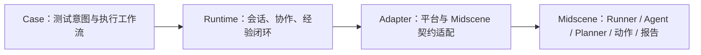

# MTA 当前架构

MTA 是移动终端 AI 自动化测试框架，Midscene 是底层执行引擎。下图是职责边界，不表示已经存在四个独立源码包；当前 Runtime 和 Adapter 的实现仍共处既有目录。

## 职责与现有代码

| 边界 | 职责 | 当前落点 |
| --- | --- | --- |
| Case | 使用方定义测试目标、业务数据、流程及业务断言；当前通过 Expert Mode / Execution Workflow YAML 表达 | `cases/`；语法见 [YAML 指南](docs/midscene-yaml-guide.md) |
| Runtime | 设备选择、会话生命周期、多设备协作、通用节点、经验资格检查及学习/重放/回退组合 | `src/setup/` + `src/nodes/` + `src/experience/` |
| Adapter | 隔离平台 Agent、原生 Node 执行上下文、动作派发、dump 解析与报告关联 | 分布于下述现有适配入口；尚无独立 `src/adapters/` |
| Midscene | 工作流收集和运行、超时/取消机制、AI 规划、设备原生动作、截图与报告 | 锁定的 `@midscene/*` 依赖；`midscene.config.ts` 组装三个项目 |

`setup + nodes + experience = Runtime capabilities` 是职责归属，不要求把它们合并成一个模块。Adapter 是其中对外部契约负责的部分。Midscene Runner 实际调度注册的 MTA Node；图中的箭头表达职责依赖，而非所有调用的时间顺序。

当前 YAML 不是最终用户模型。更高层 Case Authoring 尚未实现，其规划只在 [Roadmap](openspec/roadmap.md) 中维护。

## Runtime 范围

- setup 管理 Android/HarmonyOS 的确定性设备选择、Agent 接管与释放；协作项目通过显式 alias 绑定设备。
- nodes 暴露通用运行能力：原生节点适配、设备生命周期、跨设备并行、实验经验动作。业务流程和业务状态判定属于 Case。
- Experience 已包含 Schema、Store、Promotion、Matcher、Replay、Runtime、Integration。Schema/Store 管资产；Promotion 转换轨迹；Matcher 校验画面；Replay 派发已定位动作；Runtime 决定查找、重放、至多一次原生 AI 回退与学习；Integration 提供默认关闭的 YAML `aiAct` 包装。
- 纯动作资格策略由使用方注入，默认空表。取消、超时或未知副作用不能引发盲目追加操作；视觉终态检查不替代业务语义断言。
- 现有 `device.recover` 仅回到主屏；Experience 已有受限回退。它们不表示已经提供通用业务恢复系统。

## Midscene 契约入口

现有入口清单用于定位和维护，不表示依赖已经完全收口：

| 契约 | 现有落点 |
| --- | --- |
| 平台 Agent、设备发现与会话 | `src/setup/android.ts`、`harmony.ts`、`harmony-experience.ts`、`multi-device.ts` |
| 原生 Node 注册与 alias 转发 | `midscene.config.ts`、`src/nodes/alias-nodes.ts`、`multi-device.ts` |
| Agent 截图、原生 AI、dump、报告观测 | `src/experience/runtime/adapters.ts`、`observe.ts` |
| Node 身份与报告关联 | `src/experience/runtime/identity.ts`、`integration/wrap.ts`、`src/nodes/experience-act.ts` |
| dump 轨迹格式解析 | `src/experience/promotion/trace-adapter.ts` |
| 已定位动作与原生参数 | `src/experience/replay/replay.ts`、`native-actions.ts` |
| 并行子调用报告关联 | `src/nodes/device-parallel.ts` |

后续修改须复用这些适配职责，通过小接口向 Runtime 提供所需数据；不得在新 Node 或业务逻辑中复制 dump/report/executionId 等契约访问。若现有入口不足，先在相应适配边界封装，并以锁定依赖的契约测试验证。既有散落访问仅允许维护和逐步收口，不作为扩散的先例。

## 示例、证据与扩展约束

`cases/` 是使用方工作流接入位置；其中既有演示文件已标为“示例/验收用例”，清单见 [cases/README.md](cases/README.md)。新增示例统一放 `examples/`，框架夹具放 `tests/fixtures/`。示例存在不代表真实设备业务验收通过。

文档推荐 `DUT1/DUT2/DUT3`；底层 alias 仍接受任意合法名称。未配置时的兼容默认值仍是 `phone1/phone2`，使用 DUT 工作流前必须显式设置绑定。

Node 扩展、Experience 冻结和编码禁止事项以 [AGENTS.md](AGENTS.md) 为准；当前能力见 [README](README.md)，分阶段验证范围见 [验收索引](docs/acceptance-index.md)。
