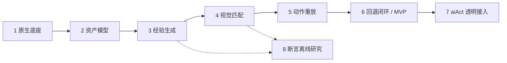

# Midscene 整机测试实施路线图

本路线图对应当前已规划的 8 个 Change。所有提案、规格、设计和任务清单已生成；这表示规划就绪，不表示工程或 Experience 能力已经实现。实施按下表推进，前序验证完成后再进入依赖它的 Change。

## 实施顺序

| 顺序 | Change / 提案 | 任务入口 | 核心交付 | 直接前置 |
| --- | --- | --- | --- | --- |
| 1 | [bootstrap-midscene-mobile-test](changes/bootstrap-midscene-mobile-test/proposal.md) | [tasks](changes/bootstrap-midscene-mobile-test/tasks.md) | 框架工程、Android 会话、Node 与报告接入 | 无 |
| 2 | [add-experience-model](changes/add-experience-model/proposal.md) | [tasks](changes/add-experience-model/tasks.md) | 视觉资产协议、Key、Variant、文件 Store | 1 |
| 3 | [add-experience-promotion](changes/add-experience-promotion/proposal.md) | [tasks](changes/add-experience-promotion/tasks.md) | 原生轨迹取数契约与 candidate 生成 | 2 |
| 4 | [add-visual-matcher](changes/add-visual-matcher/proposal.md) | [tasks](changes/add-visual-matcher/tasks.md) | 本地页面/目标/状态匹配 | 2、3 |
| 5 | [add-experience-replay](changes/add-experience-replay/proposal.md) | [tasks](changes/add-experience-replay/tasks.md) | 逐动作观察及原生动作重放 | 4 |
| 6 | [add-experience-fallback](changes/add-experience-fallback/proposal.md) | [tasks](changes/add-experience-fallback/tasks.md) | experienceAct 与框架闭环集成矩阵 | 3、5 |
| 7 | [integrate-experience-with-ai-act](changes/integrate-experience-with-ai-act/proposal.md) | [tasks](changes/integrate-experience-with-ai-act/tasks.md) | 项目 YAML aiAct 可关闭透明接入 | 6 |
| 8 | [add-visual-assert-experience](changes/add-visual-assert-experience/proposal.md) | [tasks](changes/add-visual-assert-experience/tasks.md) | 离线断言实验与 go/no-go 结论 | 3、4；建议 6 后开展 |

1–6 构成动作 Experience MVP。7 在 MVP 验收后接入原生用例语法。8 是独立研究分支，不要求先完成 7，也不阻塞动作 MVP。

图中主链包含传递依赖；上表列出直接依赖。依赖关系写在本路线图和各提案中，未伪造 CLI 不支持的跨 Change 元数据。OpenSpec 的 `status` 只显示单个 Change 的规划产物就绪情况，不能代替前序实施验收。

## 每个 Change 的完成方式

1. 先阅读该 Change 的 proposal、specs、design、tasks，核对直接前置的实际交付与验收证据。
2. 明确选择名称后执行 apply，例如：`$openspec-apply-change bootstrap-midscene-mobile-test`。也可以直接告诉助手“实施 bootstrap-midscene-mobile-test”。
3. 按任务完成框架检查与集成验证，只有有证据的任务才勾选。设备/模型边界可受控替换，实际原生依赖契约仍须验证；具体业务执行不作为这些 Change 的前提。
4. 验证实现与规格一致，再使用 OpenSpec verify/archive 流程收敛当前 Change 和主规格，随后进入下一个。
5. 若前序发现接口或协议变化，先修订受影响的后续规划再实施；不要仅因后续文档已经生成就沿用过时假设。

每个目录均包含 `proposal.md`、`design.md`、`tasks.md` 和 `specs/<capability>/spec.md`（第 1 个有两份规格）。本轮没有跳过必需产物，也没有执行实现任务。

## 框架与使用方边界

| 框架交付 | 使用方负责 |
| --- | --- |
| 工程配置、设备会话和原生能力接入 | 选择测试设备与运行环境 |
| 通用 prepare/recover 能力 | 定义业务起点与业务状态恢复 |
| Experience Schema、Store、Promotion、Matcher、Replay、Runtime | 提供测试意图及经验资格策略 |
| aiAct 接入、失败传播、原生报告关联 | 编写 YAML、组织业务流程并判断业务结果 |
| 单元、原生契约与模块组合测试 | 按自身需求开展真实业务验收 |

业务用例不属于当前 8 个 Change 的交付物。cases/ 可作为使用方接入位置；tests/fixtures/ 中最小的 YAML、截图和轨迹仅用于验证框架。框架测试不建立业务场景库，也不要求某个手机业务流程通过。

## 三个阶段检查点

### 原生底座完成：Change 1

安装、类型、参考生成和框架测试通过，设备选择、资源清理、Node 输入、原生生命周期及报告接入有契约证据。真实设备连接/截图等单能力检查可选，不能把未执行的硬件行为写成已通过。

### 核心可行性确认：Change 3

验证实际锁定 Midscene 包的公开取数边界、完整轨迹关联和自动 candidate 发布。可使用受控设备/模型传输与原生集成生成的轨迹夹具；纯手写轨迹只能测试解析器，不能证明官方接口可取数。无需指定业务 YAML 或业务结果。

### 框架 MVP 完成：Change 6

组合实际 Store、Promoter、Matcher、Replay 和 Runtime，以可控边界完成矩阵：

| 输入/条件 | 预期框架行为 |
| --- | --- |
| 空 Store、合格调用成功 | 原生回调一次，生成 candidate |
| 有效候选与匹配截图 | 重放、激活、模型请求为零 |
| 支持范围内目标位移 | 派发位置来自当前匹配框 |
| 入口失配或可恢复中途失败 | 停止旧链，依策略回退，正确记录真实入口 |
| 学习更新后的相同入口 | 复用新候选，统计和修订正确 |
| 未知副作用、取消、超时 | 停止，不追加盲目执行 |
| Store/Promotion 失败 | 保留原生调用结果，错误可见且不重复操作 |

同时验证原生报告关联和模型观测边界。可以用临时 Store 连续测试学习、复用、失效和更新，但不要求连续执行业务流程。框架验证结果与真实设备、真实模型效果分开记录。

## 跨 Change 共用边界

- 项目继续使用 Midscene 的 Runner、Agent、规划、原生动作、截图、生命周期和报告。
- 同一请求可有不同环境与入口 Variant；有候选不等于能点击，必须先检查当前画面。
- 框架提供由使用方注入的纯动作资格策略，默认集合为空。内嵌语义断言、动态输出和未支持参数走原生路径。
- 中途回退从当前 UI 执行完整目标；只有副作用明确且策略允许时才能继续。取消、超时和未知执行结果不能追加盲目重试。
- AI 后缀经验保存其真实入口，不冒充原始入口的完整链。末尾画面检查不替代原生语义断言。
- 透明接入默认关闭，限定当前项目 YAML；直接 SDK aiAct 调用与其他项目不受影响。
- 断言研究保持独立资产、人工真值和冻结验证集；go 只代表建议另开生产化 Change，no-go 也可完成研究。

## 规划校验

各 Change 使用默认 `spec-driven` schema。可运行 `openspec validate <change-name> --strict` 检查规划格式与结构；任务清单中的框架测试是未来实施要求，不能与本轮 OpenSpec 校验混为一谈。
